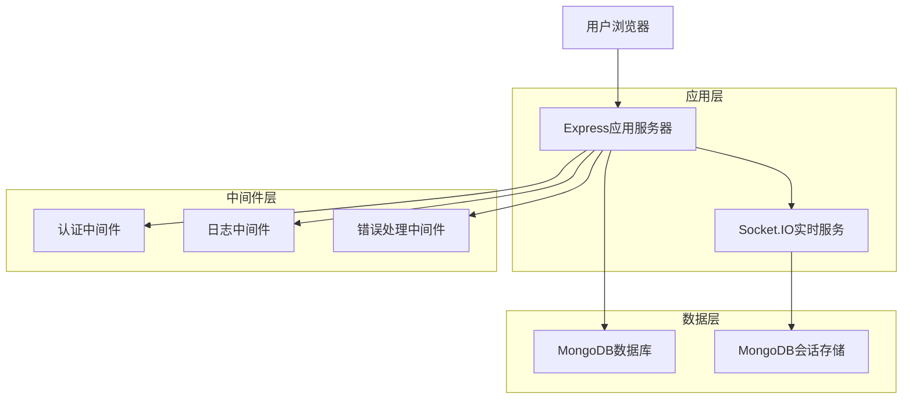
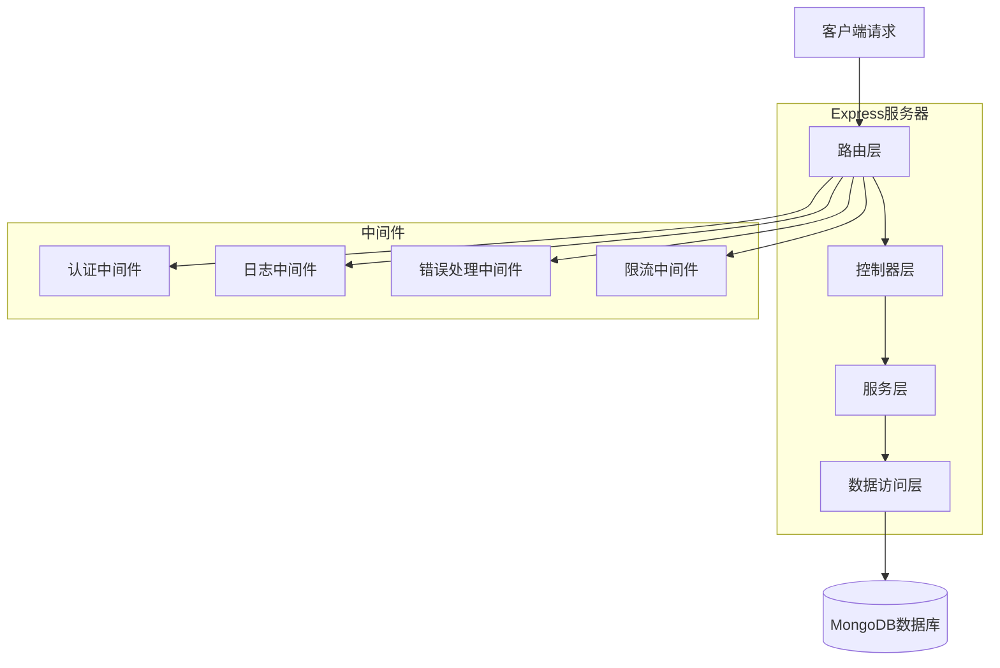
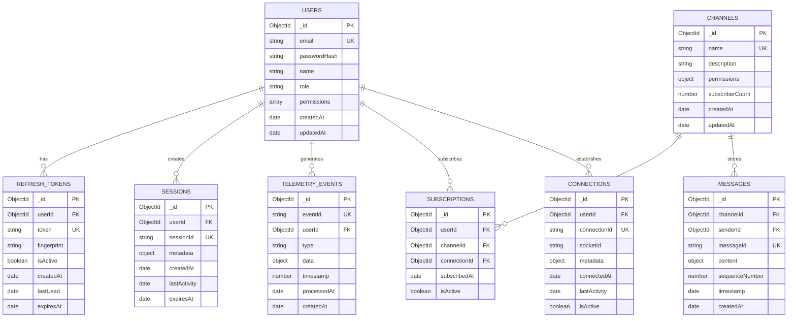

# BMT后端MongoDB重构技术架构文档

## 1. 架构设计



## 2. 技术描述

- 前端：React@18 + tailwindcss@3 + vite
- 后端：Express@5 + Socket.IO@4 + Mongoose@8
- 数据库：MongoDB（通过Mongoose ODM）
- 认证：JWT + bcrypt
- 日志：Winston

## 3. 路由定义

| 路由 | 用途 |
|------|------|
| /v1/telemetry/ingest | 遥测数据接收接口，支持批量数据存储 |
| /v1/auth/login | 用户登录接口，返回JWT令牌 |
| /v1/auth/refresh | 刷新令牌接口，更新访问令牌 |
| /v1/auth/logout | 用户登出接口，撤销刷新令牌 |
| /api/realtime/stats | 实时通信统计接口，返回连接和频道信息 |
| /api/health | 系统健康检查接口，包含数据库连接状态 |

## 4. API定义

### 4.1 核心API

#### 遥测数据接收
```
POST /v1/telemetry/ingest
```

请求参数：
| 参数名称 | 参数类型 | 是否必需 | 描述 |
|----------|----------|----------|------|
| events | array | true | 遥测事件数组 |
| events[].id | string | true | 事件唯一标识符 |
| events[].type | string | true | 事件类型（page/error/api/perf/custom） |
| events[].timestamp | number | true | 事件时间戳 |
| events[].data | object | true | 事件数据内容 |

响应参数：
| 参数名称 | 参数类型 | 描述 |
|----------|----------|------|
| success | boolean | 处理结果状态 |
| received | number | 接收的事件数量 |
| processed | number | 成功处理的事件数量 |
| duplicates | number | 重复事件数量 |
| errors | array | 错误事件列表 |

示例：
```json
{
  "events": [
    {
      "id": "evt_123456",
      "type": "page",
      "timestamp": 1640995200000,
      "data": {
        "url": "/dashboard",
        "title": "仪表板",
        "loadTime": 1200
      }
    }
  ]
}
```

#### 用户认证
```
POST /v1/auth/login
```

请求参数：
| 参数名称 | 参数类型 | 是否必需 | 描述 |
|----------|----------|----------|------|
| email | string | true | 用户邮箱 |
| password | string | true | 用户密码 |
| fingerprint | string | false | 设备指纹 |

响应参数：
| 参数名称 | 参数类型 | 描述 |
|----------|----------|------|
| success | boolean | 登录结果状态 |
| accessToken | string | 访问令牌 |
| refreshToken | string | 刷新令牌 |
| expiresIn | number | 令牌过期时间（秒） |
| user | object | 用户信息 |

示例：
```json
{
  "email": "admin@example.com",
  "password": "password123",
  "fingerprint": "fp_abc123"
}
```

#### 令牌刷新
```
POST /v1/auth/refresh
```

请求参数：
| 参数名称 | 参数类型 | 是否必需 | 描述 |
|----------|----------|----------|------|
| refreshToken | string | true | 刷新令牌 |
| fingerprint | string | false | 设备指纹 |

响应参数：
| 参数名称 | 参数类型 | 描述 |
|----------|----------|------|
| success | boolean | 刷新结果状态 |
| accessToken | string | 新的访问令牌 |
| expiresIn | number | 令牌过期时间（秒） |

## 5. 服务器架构图



## 6. 数据模型

### 6.1 数据模型定义



### 6.2 数据定义语言

#### 用户表 (users)
```javascript
// 创建用户模型
const userSchema = new mongoose.Schema({
  email: {
    type: String,
    required: true,
    unique: true,
    lowercase: true,
    trim: true
  },
  passwordHash: {
    type: String,
    required: true
  },
  name: {
    type: String,
    required: true,
    trim: true
  },
  role: {
    type: String,
    enum: ['admin', 'user'],
    default: 'user'
  },
  permissions: [{
    type: String
  }]
}, {
  timestamps: true
});

// 创建索引
userSchema.index({ email: 1 });
userSchema.index({ role: 1 });

// 初始化数据
const initUsers = [
  {
    email: 'admin@example.com',
    passwordHash: await bcrypt.hash('password123', 10),
    name: '管理员',
    role: 'admin',
    permissions: ['telemetry:read', 'telemetry:write', 'admin:all']
  },
  {
    email: 'user@example.com',
    passwordHash: await bcrypt.hash('password123', 10),
    name: '普通用户',
    role: 'user',
    permissions: ['telemetry:write']
  }
];
```

#### 刷新令牌表 (refresh_tokens)
```javascript
const refreshTokenSchema = new mongoose.Schema({
  userId: {
    type: mongoose.Schema.Types.ObjectId,
    ref: 'User',
    required: true
  },
  token: {
    type: String,
    required: true,
    unique: true
  },
  fingerprint: {
    type: String,
    default: null
  },
  isActive: {
    type: Boolean,
    default: true
  },
  lastUsed: {
    type: Date,
    default: Date.now
  },
  expiresAt: {
    type: Date,
    required: true
  }
}, {
  timestamps: true
});

// 创建索引
refreshTokenSchema.index({ token: 1 });
refreshTokenSchema.index({ userId: 1 });
refreshTokenSchema.index({ expiresAt: 1 }, { expireAfterSeconds: 0 });
```

#### 遥测事件表 (telemetry_events)
```javascript
const telemetryEventSchema = new mongoose.Schema({
  eventId: {
    type: String,
    required: true,
    unique: true
  },
  userId: {
    type: mongoose.Schema.Types.ObjectId,
    ref: 'User',
    default: null
  },
  type: {
    type: String,
    required: true,
    enum: ['page', 'error', 'api', 'perf', 'custom', 'event']
  },
  data: {
    type: mongoose.Schema.Types.Mixed,
    required: true
  },
  timestamp: {
    type: Number,
    required: true
  },
  processedAt: {
    type: Date,
    default: Date.now
  }
}, {
  timestamps: true
});

// 创建索引
telemetryEventSchema.index({ eventId: 1 });
telemetryEventSchema.index({ type: 1, timestamp: -1 });
telemetryEventSchema.index({ userId: 1, timestamp: -1 });
telemetryEventSchema.index({ createdAt: -1 });
```

#### WebSocket连接表 (connections)
```javascript
const connectionSchema = new mongoose.Schema({
  userId: {
    type: mongoose.Schema.Types.ObjectId,
    ref: 'User',
    required: true
  },
  connectionId: {
    type: String,
    required: true,
    unique: true
  },
  socketId: {
    type: String,
    required: true
  },
  metadata: {
    userAgent: String,
    ipAddress: String,
    fingerprint: String
  },
  connectedAt: {
    type: Date,
    default: Date.now
  },
  lastActivity: {
    type: Date,
    default: Date.now
  },
  isActive: {
    type: Boolean,
    default: true
  }
}, {
  timestamps: true
});

// 创建索引
connectionSchema.index({ connectionId: 1 });
connectionSchema.index({ userId: 1, isActive: 1 });
connectionSchema.index({ lastActivity: 1 });
```

#### 频道表 (channels)
```javascript
const channelSchema = new mongoose.Schema({
  name: {
    type: String,
    required: true,
    unique: true,
    trim: true
  },
  description: {
    type: String,
    default: ''
  },
  permissions: {
    subscribe: [String],
    publish: [String]
  },
  subscriberCount: {
    type: Number,
    default: 0
  }
}, {
  timestamps: true
});

// 创建索引
channelSchema.index({ name: 1 });
```

#### 订阅关系表 (subscriptions)
```javascript
const subscriptionSchema = new mongoose.Schema({
  userId: {
    type: mongoose.Schema.Types.ObjectId,
    ref: 'User',
    required: true
  },
  channelId: {
    type: mongoose.Schema.Types.ObjectId,
    ref: 'Channel',
    required: true
  },
  connectionId: {
    type: mongoose.Schema.Types.ObjectId,
    ref: 'Connection',
    required: true
  },
  subscribedAt: {
    type: Date,
    default: Date.now
  },
  isActive: {
    type: Boolean,
    default: true
  }
}, {
  timestamps: true
});

// 创建复合索引
subscriptionSchema.index({ userId: 1, channelId: 1 });
subscriptionSchema.index({ connectionId: 1 });
subscriptionSchema.index({ channelId: 1, isActive: 1 });
```

#### 消息表 (messages)
```javascript
const messageSchema = new mongoose.Schema({
  channelId: {
    type: mongoose.Schema.Types.ObjectId,
    ref: 'Channel',
    required: true
  },
  senderId: {
    type: mongoose.Schema.Types.ObjectId,
    ref: 'User',
    default: null
  },
  messageId: {
    type: String,
    required: true,
    unique: true
  },
  content: {
    type: mongoose.Schema.Types.Mixed,
    required: true
  },
  sequenceNumber: {
    type: Number,
    required: true
  },
  timestamp: {
    type: Number,
    required: true
  }
}, {
  timestamps: true
});

// 创建索引
messageSchema.index({ messageId: 1 });
messageSchema.index({ channelId: 1, sequenceNumber: -1 });
messageSchema.index({ channelId: 1, timestamp: -1 });
```