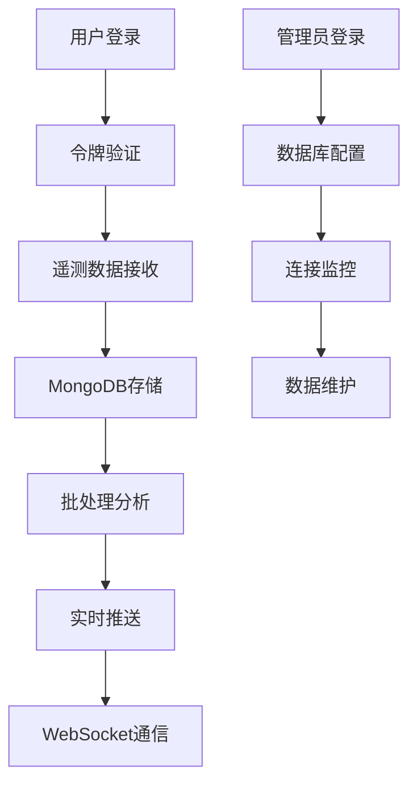

# BMT后端MongoDB重构需求文档

## 1. 产品概述

本项目旨在将BMT后端Express系统中所有使用内存存储（Map数据结构）的功能模块重构为使用MongoDB进行数据持久化存储。

- 解决当前内存存储在服务重启时数据丢失的问题，提供可靠的数据持久化能力
- 为前端开发者提供简单易懂的MongoDB集成方案，避免复杂的数据库操作
- 确保系统的高可用性和数据一致性，支持生产环境部署

## 2. 核心功能

### 2.1 用户角色

| 角色 | 注册方式 | 核心权限 |
|------|----------|----------|
| 系统管理员 | 预设账户 | 可管理所有数据、查看系统统计、执行数据库维护操作 |
| 普通用户 | API注册 | 可发送遥测数据、使用实时通信功能 |

### 2.2 功能模块

本重构项目涉及以下核心页面和功能：

1. **遥测数据管理页面**：事件存储、批处理管理、数据查询统计
2. **用户认证管理页面**：用户登录、令牌管理、会话控制
3. **实时通信管理页面**：连接管理、频道订阅、消息处理
4. **数据库配置页面**：MongoDB连接配置、数据库状态监控

### 2.3 页面详情

| 页面名称 | 模块名称 | 功能描述 |
|----------|----------|----------|
| 遥测数据管理页面 | 事件存储模块 | 保存遥测事件到MongoDB、支持批量插入、事件去重检查 |
| 遥测数据管理页面 | 数据查询模块 | 按时间范围查询事件、按事件类型筛选、分页显示结果 |
| 遥测数据管理页面 | 批处理管理模块 | 定时批处理事件、按类型分组处理、处理状态跟踪 |
| 用户认证管理页面 | 用户管理模块 | 用户信息CRUD操作、密码加密存储、用户角色管理 |
| 用户认证管理页面 | 令牌管理模块 | JWT令牌生成验证、刷新令牌存储、令牌撤销功能 |
| 用户认证管理页面 | 会话管理模块 | 用户会话跟踪、多设备登录控制、会话过期处理 |
| 实时通信管理页面 | 连接管理模块 | WebSocket连接信息存储、连接状态监控、连接清理 |
| 实时通信管理页面 | 频道管理模块 | 频道信息存储、订阅关系管理、权限控制 |
| 实时通信管理页面 | 消息处理模块 | 消息持久化存储、离线消息处理、消息确认机制 |
| 数据库配置页面 | 连接配置模块 | MongoDB连接字符串配置、连接池设置、超时配置 |
| 数据库配置页面 | 监控模块 | 数据库连接状态监控、性能指标显示、错误日志查看 |

## 3. 核心流程

### 管理员流程
1. 管理员登录系统 → 查看数据库连接状态 → 配置MongoDB连接参数 → 执行数据迁移操作 → 监控系统运行状态

### 普通用户流程
1. 用户注册/登录 → 获取访问令牌 → 发送遥测数据 → 建立WebSocket连接 → 订阅频道接收消息

### 系统内部流程
1. 接收遥测数据 → 数据验证 → 存储到MongoDB → 批处理分析 → 实时推送结果

## 4. 用户界面设计

### 4.1 设计风格

- **主色调**：蓝色系（#2563eb）和灰色系（#64748b）
- **按钮样式**：圆角按钮，支持悬停效果
- **字体**：系统默认字体，标题16px，正文14px
- **布局风格**：卡片式布局，左侧导航栏设计
- **图标风格**：简洁的线性图标，支持状态指示

### 4.2 页面设计概览

| 页面名称 | 模块名称 | UI元素 |
|----------|----------|--------|
| 遥测数据管理页面 | 数据展示区域 | 表格组件、分页器、筛选器、状态指示灯 |
| 用户认证管理页面 | 用户列表区域 | 用户卡片、操作按钮、状态标签、搜索框 |
| 实时通信管理页面 | 连接监控区域 | 实时图表、连接列表、频道树形结构 |
| 数据库配置页面 | 配置表单区域 | 输入框、下拉选择、开关按钮、测试连接按钮 |

### 4.3 响应式设计

采用桌面优先的响应式设计，支持移动端适配，考虑触摸交互优化。